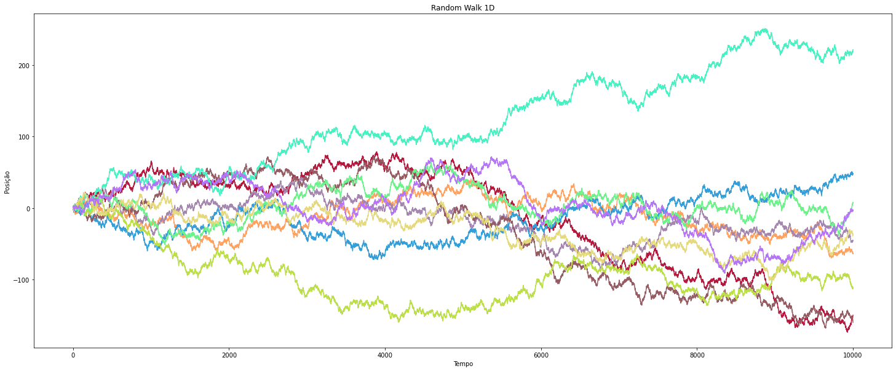
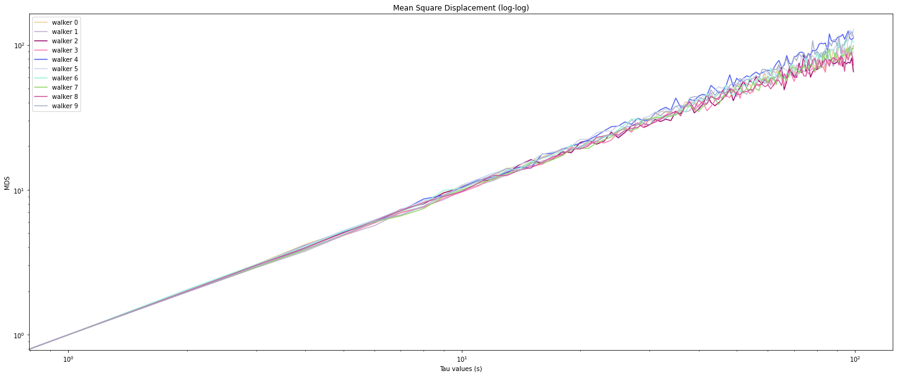
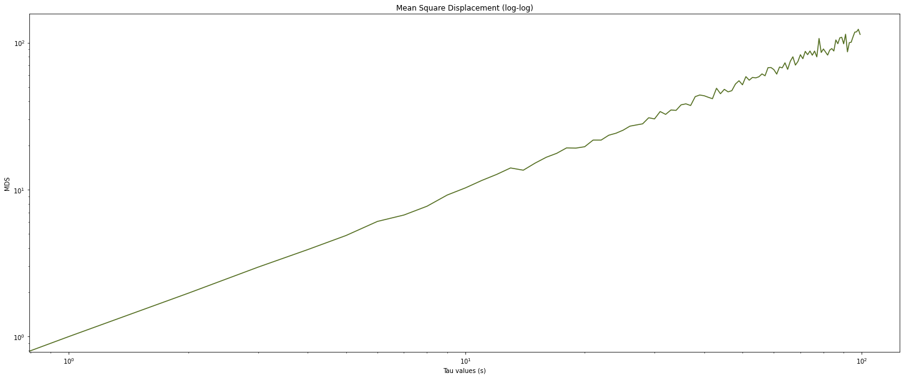
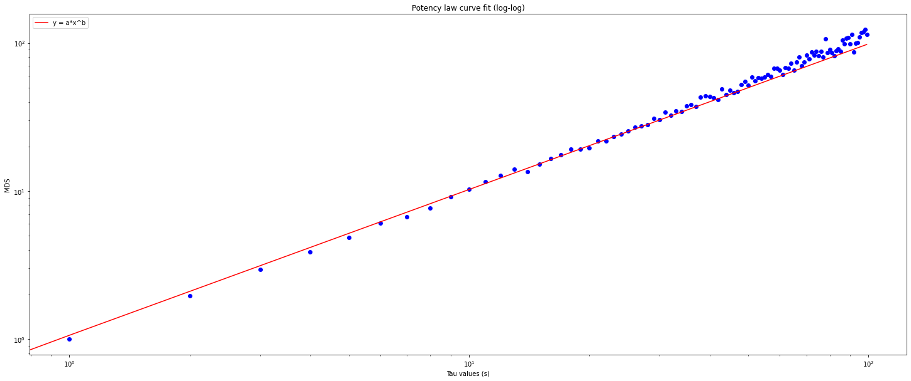
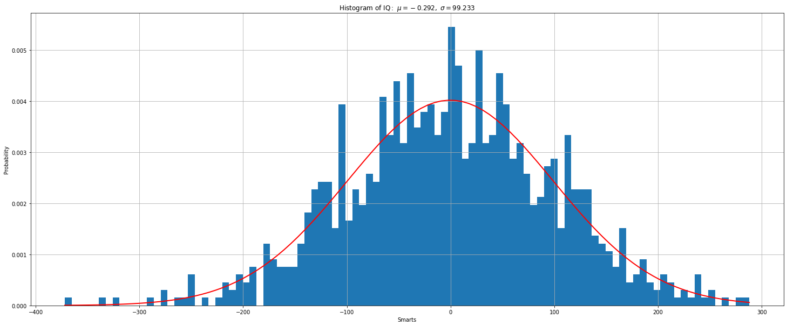

# Random Walk

Algoritmo para simular o random walk em 1 + 1 dimensões (posição x e tempo) e analisar simulação.

Feito por Germano Teixeira de Miranda para a disciplina Princípios de Modelagem Matemática do Mestrado em Modelagem Matemática e Computacional do CEFET-MG. 

link: https://github.com/germanotm/random-walk

## Introdução

O Random walk, ou passeio aleatório em português, consiste em realizar sucessivos passos em direções aleatórias. O random walk pode ser realizado para qualquer número de dimensões e possui diversas aplicações práticas, como por exemplo o movimento browniano que descreve a movimentação de partículas suspensas em um fluido.

Neste trabalho criamos uma simulação de um random walk em uma dimensão, ou seja, a cada passo a entidade pode se mover para a direita ou para a esquerda e o módulo do passo é 1. Com a simulação podemos realizar análises sobre os dados e observar propriedades importantes do random walk.

## Metodologia

Para realizar a simulação utilizamos python 3. Utilizamos as bibliotecas numpy para realizar operações com vetores, matplotlib para desenhar os gráficos, scipy para ajuste de curvas e criação do histograma. Para melhorar a legibilidade e organizar o código utilizamos o jupyterlab.

O desenvolvimento deste trabalho foi executado em 6 etapas.

Etapa 1: Gerador de números aleatórios e simulação do random walk com 1+1 dimensão (posição x tempo). \
Para garantir a aleatoriedade do movimento, implementamos um gerador de números aleatórios congruencial e utilizamos o seu resultado para decidir qual direção se mover em cada passo. Um gerador de números aleatórios congruencial funciona através da relação de recorrência definida por $ x_{n+1} = (aX_{n} + c)  \mod  m $.

Etapa 2: Executar 10 caminhadas com 10000 passos cada. \
Executamos o caminho aleatório 10 vezes com 10000 passos a cada iteração e desenhamos um gráfico mostrando o caminho percorrido. 
  
Etapa 3: Calcular o desvio quadrático médio $(R^{2})$ para as 10 amostras e represente graficamente em escala log-log  $R^{2}$ x t. \
Com os caminhos simulados calculamos o desvio médio quadrático $R^{2}$ (Mean Square Displacement) e mostramos graficamente em uma escala log-log. 

Etapa 4: Ajustar a curva encontrada com uma lei de potência (alométrica). \
Utilizamos o desvio médio quadrático calculado para ajustar uma função de lei de potência $(y = ax^{b})$ e desenhamos um novo gráfico com os dados $R^{2}$ e a função ajusta para visualizar a qualidade do ajuste. 

Etapa 5: Verificamos o expoente da lei de potência obtida a fim de verificar que a simulação é um verdadeiro random walk. \
Observando o expoente da função da lei de potência ajustada podemos verificar se a entidade em movimento está confinada (quando expoente é menor que um), em movimento de difusão (quando o expoente é igual a 1), ou sujeita algum fluxo ou força externa (quando expoente é maior do que 1).

Etapa 6: Verifique o teorema Central do Limite para a simulação.
Por fim geramos um histograma com o valor da posição final de cada caminhante aleatório e aproximamos o histograma com uma gaussiana para confirmar que a random walk respeita o teorema central do limite.

## Resultados

A simulação dos 10 caminhantes após realizar 10000 passos pode ser visualizada no gráfico abaixo. O gráfico mostra a posição do caminhante a cada passo realizado. Todos os caminhantes parte da origem na esquerda e a a ultima marcação mais à direita mostra a posição final. 



Calculamos o desvio médio quadratico $R^{2}$ para todos os 10 caminhantes e desenhamos um gráfico com a escala log-log. 



Para ter uma série de dados única para ajustar uma função de lei de potência, fizemos a média dos resultados obtidos do $R^{2}$ de todos os caminhantes. A curva das médias pode ser vista no gráfico abaixo.



Ajustamos a uma função de lei de potência para a série de dados e obtemos uma função com parâmetros:
$ a: 1.0632266820499991 $ e $ b: 0.9836350285341431 $. 

$$ y = 1.063226682049999x^{0.9836350285341431} $$

Desenhamos um novo gráfico com a serie de dados e com a função da lei de potência para visualizar a qualidade do ajuste.



Para verificar que a simulação respeita o teorema central do limite, desenhamos um histograma com a posição final de 1000 caminhantes e utilizamos o histograma para ajustar uma função gaussiana. O gráfico abaixo mostra o resultado obtido. 



## Discussão 

O gráfico de posição x tempo é uma ótima forma de visualizar comparativamente as diversas interações da simulação do random walk. Com ele podemos visualizar lado a lado a posição de cada simulação desde a origem até a posição final. O formato final das curvas nos permite adquirir a intuição sobre o comportamento de uma entidade se movendo de maneira aleatória.

Ao calcular o desvio médio quadrático e desenhar o gráfico na escala log-log. Vemos que as curvas são aproximadamente lineares. os gráfico log-log mostram linhas retas para funções exponenciais, variando a inclinação da reta de acordo com o expoente. 

Para identificar o expoente da função fazemos o ajuste de uma função de lei de potência. A função ajustada tem expoente 1, o que indica que o random walk implementado é realmente um caminhante aleatório.

O gráfico da função ajustada e da série de dados mostra que o ajuste feito realmente aproxima os valores da série.

O gráfico do histograma mostra o resultado da posição final de 1000 simulação. A posição final foi agrupada em blocos de 100 para cada coluna do histograma. Sobre o histograma desenhamos uma gaussiana (curva em formato de sino). Foi necessário normalizar o histograma antes de ajustar a gaussiana ajustada.

## Conclusão

O experimento mostrou que o algoritmo random walk utilizando um gerador de números aleatórios congruencial realmente gerou um caminhante aleatório. Conseguimos confirmar isso ao observar que o expoente da função da lei de potência ajustada tem expoente 1, indicando que a partícula em movimento não está confinada nem se movendo dentro de um fluxo de força externo.

O histograma desenhado com a posição final do caminhante mostra claramente que a distribuição de dados tem o formato de uma gaussiana. Ou seja, a distribuição de frequência da posição final do random walk respeita o teorema central do limite.

# Apendices

### Montando o ambiente

Instale a versão do python especificada no arquivo `.python-version`. Recomendo usar o [pyenv](https://github.com/pyenv/pyenv-installer) para gerenciar a versão do python.

Crie um ambiente virtual para instalar as dependências do projeto.
```bash
python -m venv venv
```

Feito isso, uma pasta com o nome venv foi criada dentro da pasta do projeto. Para carregar o ambiente você precisa usar o comando:
```bash
source ./venv/bin/activate
```

Instale as dependências par rodar o projeto.
```bash
pip install -r requirements.txt
```

### Rodando o projeto

Abra o jupter lab para executar o random walk com o comando
```bash
jupyter-lab
```

Clique no arquivo random_walk.ipynb e apertar o play.

### Código fonte


```python
# dependencias
%pylab inline
```

    Populating the interactive namespace from numpy and matplotlib


```python
# Linear congruential generator
# fonte: https://pt.wikipedia.org/wiki/Geradores_congruentes_lineares

def set_seed(s=123456789):
    global seed
    seed = s

set_seed()

def lcg(m=2**32+1, a=1103515245, c=12345):
    global seed
    seed = (a*seed + c) % m
    return seed

```


```python
# randomwalk parameters

walk_n = 10
step_n = 10000
step_set = [-1,1]
origin = 0
```


```python
# Simulate walk in 1D
# fonte: https://github.com/edpeake/Random-Walk

def random_walk(step_n,step_set,origin):
    steps = np.zeros((step_n,), dtype=int)
    steps = np.insert(steps,0,origin,axis=0)
    for step in range(1,step_n+1):
        direction = lcg() % 2 
        steps[step] = steps[step-1] + step_set[direction]
        
    return steps
    
```


```python
# plotting

walkers = np.zeros((walk_n,step_n+1))
for i in range(0,walk_n):
    walkers[i] = random_walk(step_n,step_set,origin)

plt.rcParams['figure.figsize'] = [25, 10]
plt.title("Random Walk 1D")
plt.xlabel("Tempo")
plt.ylabel("Posição")

for steps in walkers:
    plt.plot(np.arange(0, step_n+1), steps, color=numpy.random.rand(3,))

plt.show()
```


    

    


```python
# desvio quadrático médio (Mean Square Displacement)
# fonte: https://www.youtube.com/watch?v=yZ7zHg7goBc

def msd(tau,path):
    if tau == 0: return 0
    
    displacement_sum = 0
    for t in range(0,len(path)-tau,tau):
        displacement_sum += (path[t+tau] - path[t])**2
    return displacement_sum/(len(path)/tau)


```


```python
# mean square displacemant for all walkers, plotted with log-log scale.

tau_range = 100
msds = np.zeros((walk_n,tau_range), dtype=float)

for i in range(0,walk_n):
    for tau in range(0,tau_range):
        msds[i][tau] = msd(tau,walkers[i])
        
plt.rcParams['figure.figsize'] = [25, 10]
plt.title("Mean Square Displacement (log-log)")

plt.xlabel("Tau values (s)")
plt.xscale("log")
plt.ylabel("MDS")
plt.yscale("log")

for i in range(0,walk_n):
    plt.plot(np.arange(0, tau_range), msds[i], color=numpy.random.rand(3,), label=f"walker {i}")

plt.legend(loc="upper left")
plt.show()
```


    

    


```python
# mean value for all walkers

msd_mean = np.mean(msds, axis=0)

plt.rcParams['figure.figsize'] = [25, 10]
plt.title("Mean Square Displacement (log-log)")

plt.xlabel("Tau values (s)")
plt.xscale("log")
plt.ylabel("MDS")
plt.yscale("log")

plt.plot(np.arange(0, tau_range), msds[i], color=numpy.random.rand(3,))

plt.show()
```


    

    


```python
# potency law curve fit
# fonte: https://ichi.pro/pt/ajuste-basico-de-curva-de-dados-cientificos-com-python-164454906602761

# Import curve fitting package from scipy
from scipy.optimize import curve_fit

# Function to calculate the power-law with constants a and b
def power_law(x, a, b):
    return a*np.power(x, b)

# fit function
pars, cov = curve_fit(f=power_law, xdata=np.arange(0, tau_range), ydata=msd_mean, p0=[1, 5])
print(f"a: {pars[0]}, b: {pars[1]}")
print(f"y = {pars[0]}*x^{pars[1]}")

```

    a: 1.0632266820499991, b: 0.9836350285341431
    y = 1.0632266820499991*x^0.9836350285341431


```python
# plot data and fitted curve

plt.rcParams['figure.figsize'] = [25, 10]
plt.title("Potency law curve fit (log-log)")

plt.xlabel("Tau values (s)")
plt.xscale("log")
plt.ylabel("MDS")
plt.yscale("log")

x_data = np.arange(0, tau_range)
y_data = [power_law(x,pars[0],pars[1]) for x in x_data]

plt.scatter(np.arange(0, tau_range), msds[i], color='b')
plt.plot(x_data, y_data, color='r', label="y = a*x^b")

plt.legend(loc="upper left")
plt.show()
```


    

    


```python
# Central Limit Theorem

new_walk_n = 1000

walkers = np.zeros((new_walk_n,step_n+1))
for i in range(0,new_walk_n):
    walkers[i] = random_walk(step_n,step_set,origin)

final_positions = walkers[:,step_n]
```


```python
# plot distribution

from scipy.stats import norm

# fit gaussian
(mu, sigma) = norm.fit(final_positions)

# the histogram of the data
n, bins, patches = plt.hist(final_positions, 100, density=1)

# add a 'best fit' line
y = norm.pdf( bins, mu, sigma)
l = plt.plot(bins, y, 'r', linewidth=2)

#plot
plt.xlabel('Smarts')
plt.ylabel('Probability')
plt.title(r'$\mathrm{Histogram\ of\ IQ:}\ \mu=%.3f,\ \sigma=%.3f$' %(mu, sigma))
plt.grid(True)

plt.show()
```


    

    
