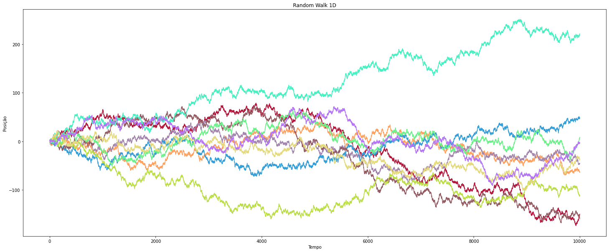

## Sobre o Random Walk

Random walk consiste em realizar sucessivos passos em direções aleatórias. Nesse trabalho exploramos um random walk em uma dimensão, ou seja, a cada passo a entidade pode se mover para a direita ou para a esquerda e o modulo do passo é 1.

O random walk pode ser realizado para qualquer número de dimensões e possui diversas aplicações práticas, como por exemplo o movimento browniano.

A figura abaixo mostra o caminho percorrido por 10 entidades após realizar 10000 passos a partir da origem.



## Montando o ambiente

Instale a versão do python especificada no arquivo `.python-version`. Recomendo usar o [pyenv](https://github.com/pyenv/pyenv-installer) para gerenciar a versão do python.

Crie um ambiente virtual para instalar as dependências do projeto.
```bash
python -m venv venv
```

Feito isso, uma pasta com o nome venv foi criada dentro da pasta do projeto. Para carregar o ambiente você precisa usar o comando:
```bash
source ./venv/bin/activate
```

Instale as dependências par rodar o projeto.
```bash
pip install -r requirements.txt
```

## Rodando o projeto

Abra o jupter lab para executar o random walk com o comando
```bash
jupyter-lab
```

Clique no arquivo random_walk.ipynb e apertar o play.